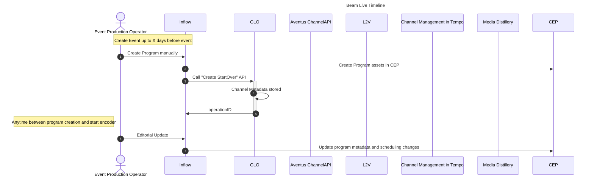

# Beam Live Timeline

Based on Mohamed Rizwan's [original Lucid Chart](https://lucid.app/lucidchart/142de44d-0b02-4fb9-b7bd-7d4fd1818ede/edit?page=0_0#)

```mermaid
sequenceDiagram 

    title Beam Live Timeline
    autonumber

    actor op as Event Production Operator
    participant Inflow
    participant GLO
    participant aventus as Aventus ChannelAPI
    participant L2V
    participant cm as Channel Management in Tempo
    participant md as Media Distillery
    participant CEP
    
    %% Inflow Event Metadata
    Note over op,Inflow: Create Event up to X days before event
    op->>Inflow: Create Program manually
    Inflow->>CEP:  Create Program assets in CEP
    
    %% Inflow sets up FER/StartOver
    Inflow->>+GLO: Call "Create StartOver" API
    GLO ->> GLO: Channel Metadata stored
    GLO ->> -Inflow: operationID
    
    Note left of op: Anytime between program creation and start encoder
    op ->> Inflow: Editorial Update
    Inflow ->> CEP:  Update program metadata and scheduling changes
    
```
